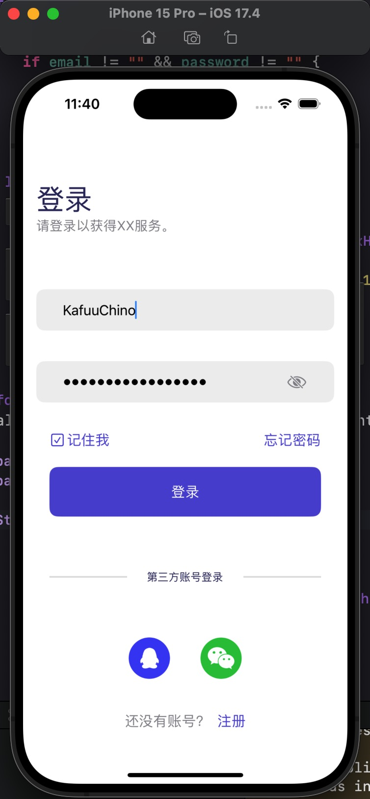
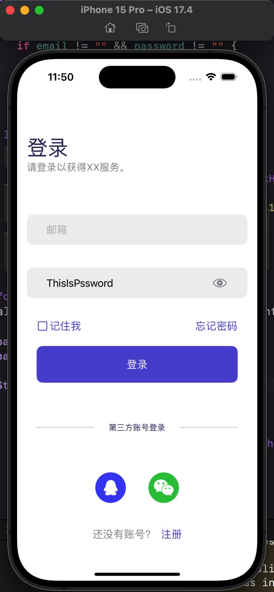
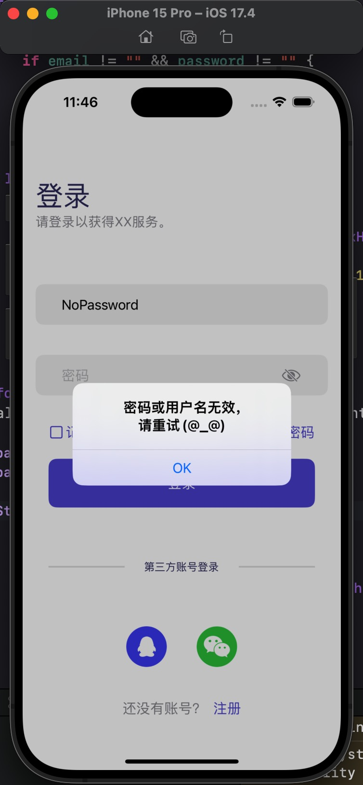

使用SwiftUI对一个登录页面进行UI复原。

## 功能实现:

* 使用 `UserDefaults` 存储数据，用户点击“记住我”后，邮箱和密码将会保存；反之如果取消则会删除；

* 使用 `URLRequest` 发送POST请求；
* 使用 `SecureField()` 密文输入框接受用户密码，并可以切换密码显示模式；

* 添加判断逻辑，当邮箱或密码为空时弹出alert。

